# Campus Event Management Platform

A simple system for colleges to post events and for students to browse, register, check in, and leave feedback. It includes basic reports for popularity, participation, attendance, and feedback.

Quick start:

- Requirements: Node.js 14+ and npm
- Install: npm install
- Setup sample data: npm run setup
- Run: npm run dev
- API: http://localhost:3000/api/v1 (health: /health)

Backend:

- In root directory
- npm install
- npm start

- It will start the backend server on port 3000 and show the health endpoint; see the screenshot below:
  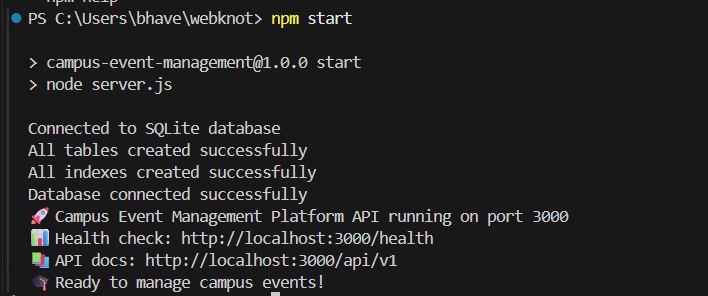

Frontend:

- Admin-portal:

- In this go to admin-portal directory
- cd frontend
- cd admin-portal
- npm install
- npm start

- now it will start the admin-portal for the adminstration in the port 3001
- below are the some screentshots of how it will look

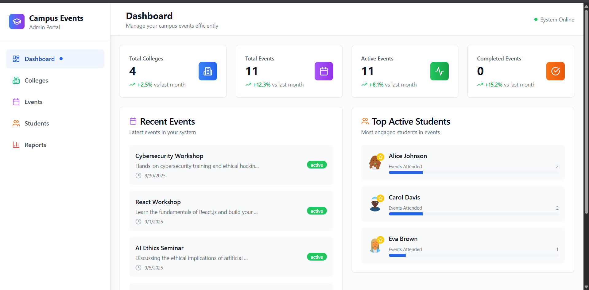
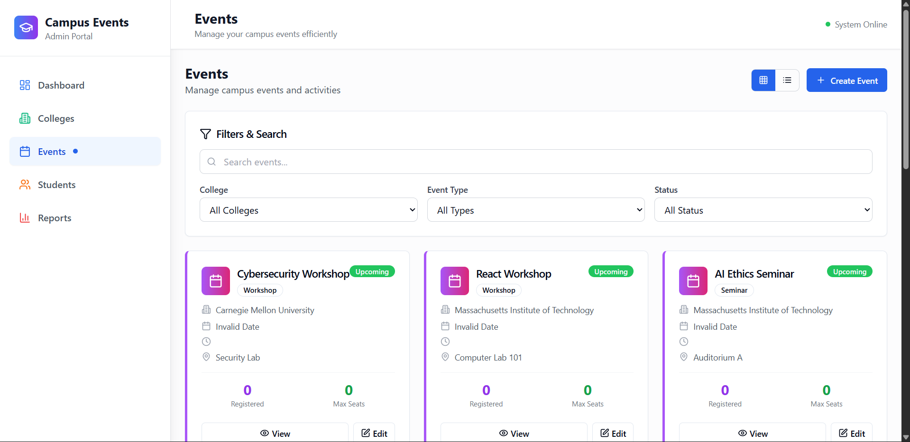
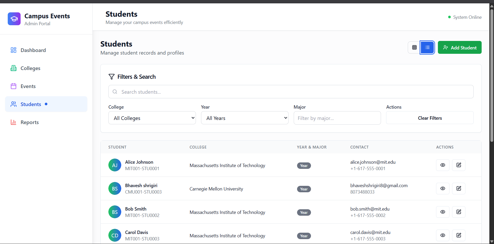
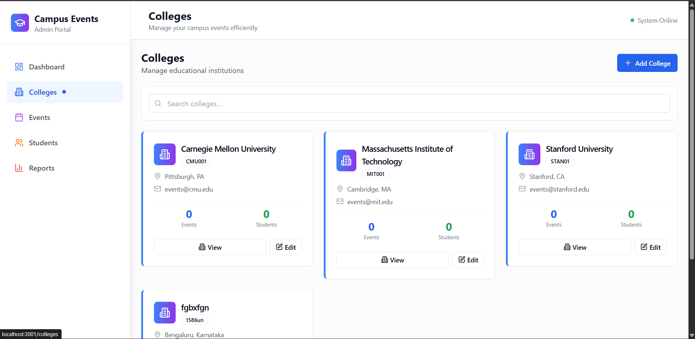
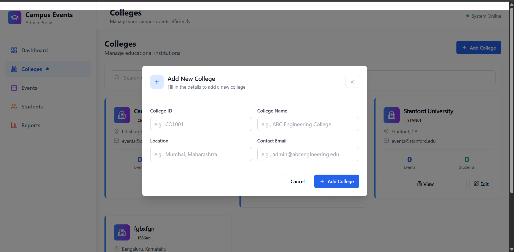
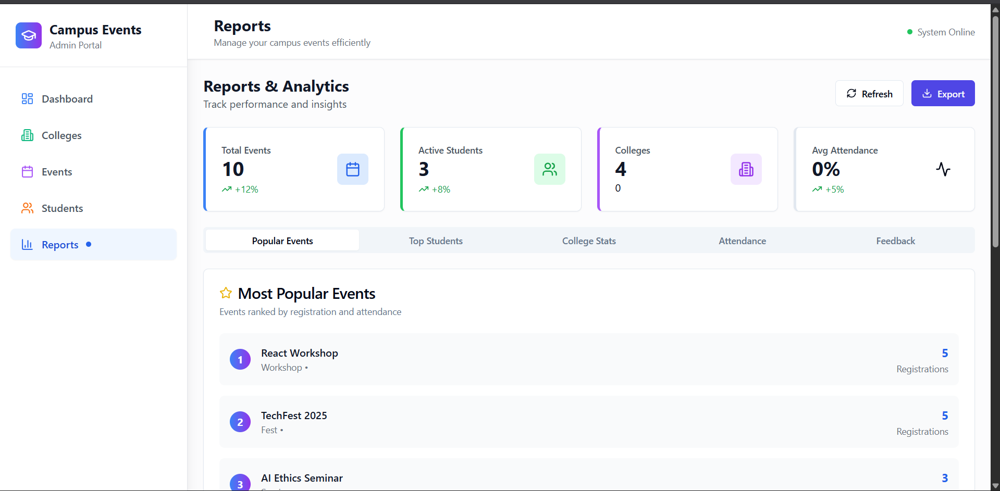

- student-app:

- In this go to student-app and run

- cd frontend
- cd student-app
- npm install
- npm start

- now it will start the student-app for the students in the port 3002
- below are the some screentshots of how it will look

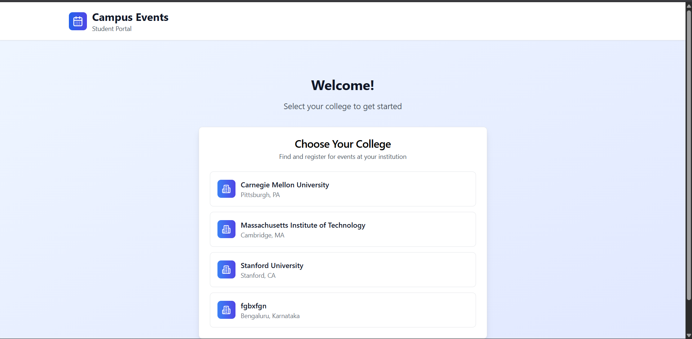
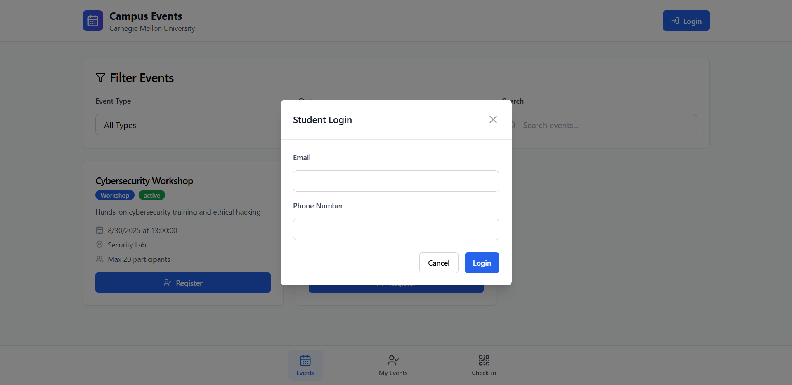
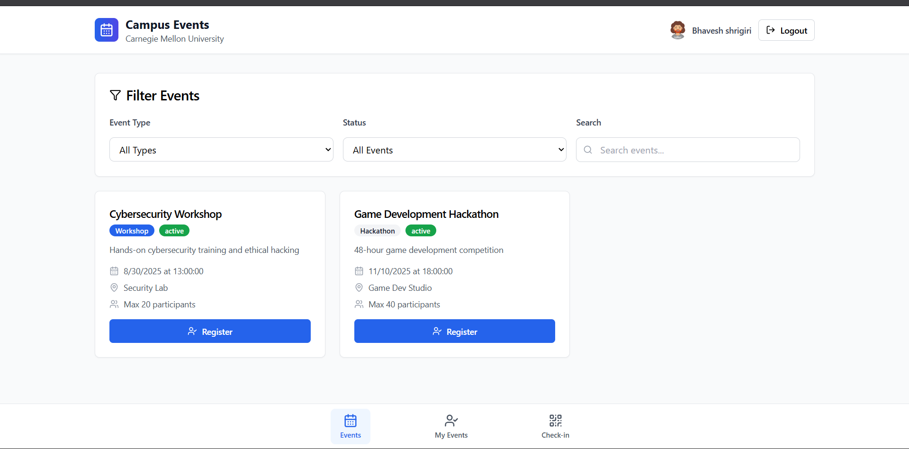
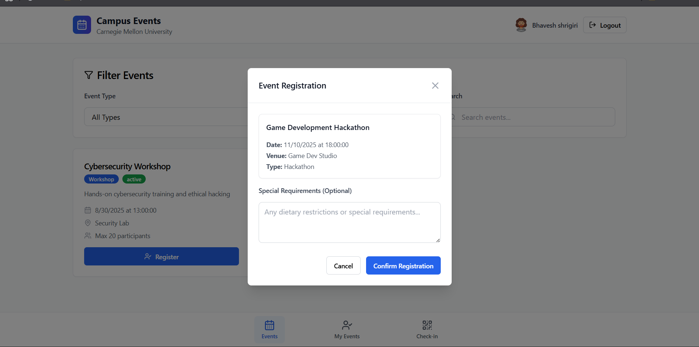
